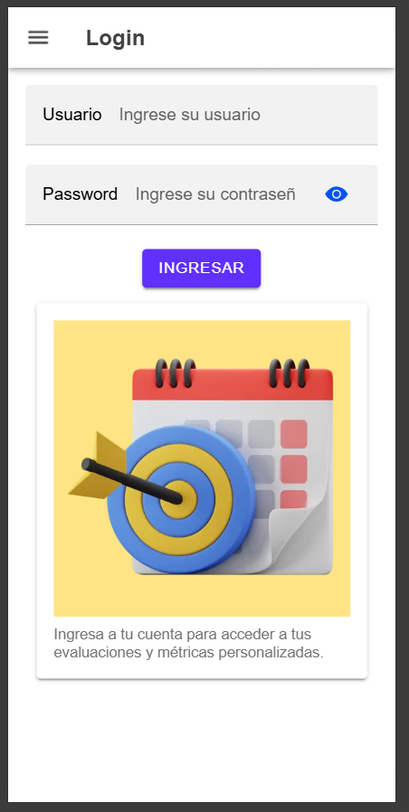
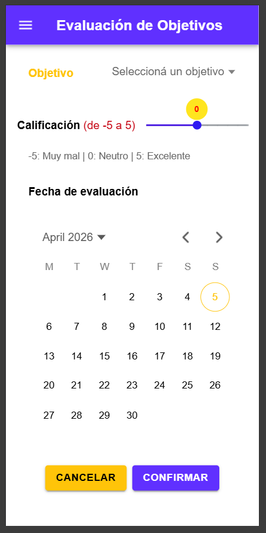
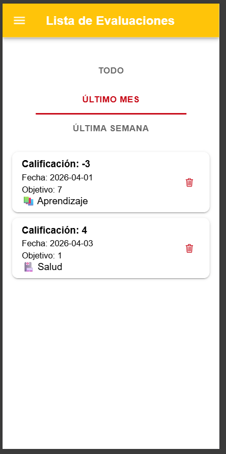
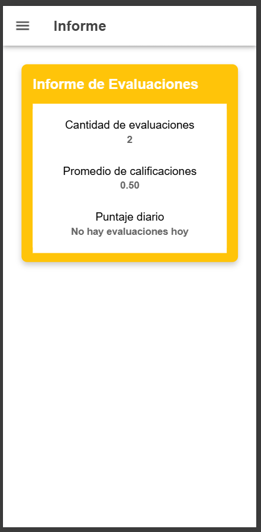
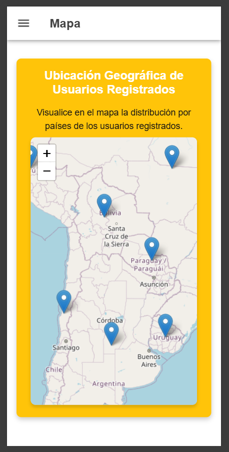

# Goalify

A mobile-first web app for personal goal tracking with daily self-assessments. Users register goals, rate their daily progress on a -5 to 5 scale, and track performance over time through a filterable evaluation list, a summary report, and an interactive map showing the geographic distribution of registered users.

> Built as an individual project for **Mobile Devices Workshop** — IT Analysis, ORT Uruguay.

**[Live demo →](https://nyah-r.github.io/Goalify/)**

---

## Screenshots

<p align="center">
  
  
  
  
</p>
<p align="center">
  
  
</p>

---

## Features

- **User registration & login** — per-user data isolation via localStorage
- **Goal management** — create and categorize personal goals
- **Daily self-assessment** — rate each goal from -5 (very bad) to 5 (excellent) with a date picker
- **Evaluation list** — filterable by all time, last month, or last week; delete individual entries
- **Performance report** — total assessments, average score, and today's score
- **User map** — interactive Leaflet map showing registered users by country

---

## Tech Stack

| | |
|---|---|
| UI Framework | Ionic (web components) |
| Map | Leaflet.js |
| Storage | localStorage (no backend) |
| Languages | HTML · CSS · JavaScript |
| Deployment | GitHub Pages |

---

## Architecture

Single-page app structured around Ionic's tab navigation. All state is managed in `localStorage` — no server, no database.

```
├── index.html        # App shell, Ionic tabs, all page markup
├── main.js           # All logic: auth, goal CRUD, assessments, map init, reports
├── estilos.css       # Custom styles on top of Ionic defaults
└── img/              # App images and screenshots
```

**Key decisions:**
- Each user's goals and assessments are stored as separate JSON arrays in localStorage, keyed by username
- Leaflet markers are generated dynamically from the registered users' country field using hardcoded country coordinates
- No build step — runs directly in the browser, deployed via GitHub Pages

---

## How to Run

Open the [live demo](https://nyah-r.github.io/Goalify/) — no installation needed.

Or run locally:

```bash
git clone https://github.com/nyah-R/Goalify.git
cd Goalify
# open index.html in a browser, or serve with any static server:
npx serve .
```

---

## Author

**Nyah Rüting** — [github.com/nyah-R](https://github.com/nyah-R)

ORT Uruguay — IT Analysis