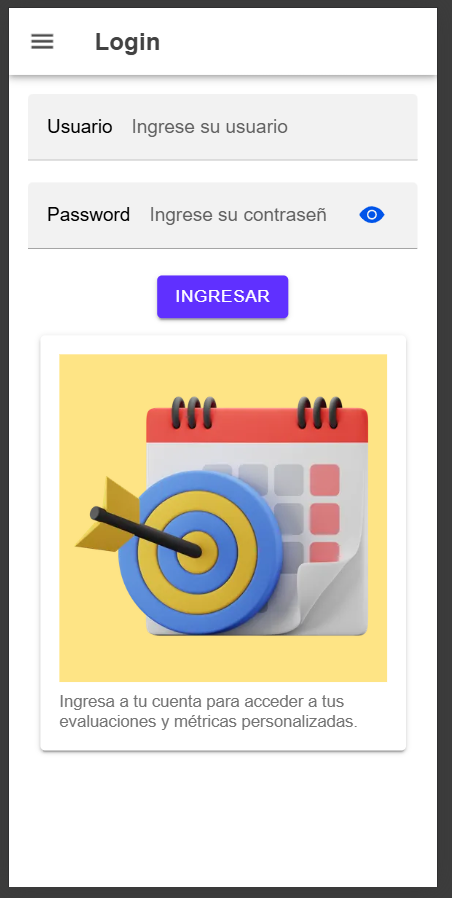
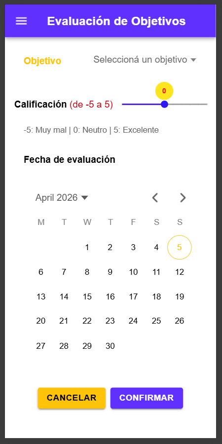
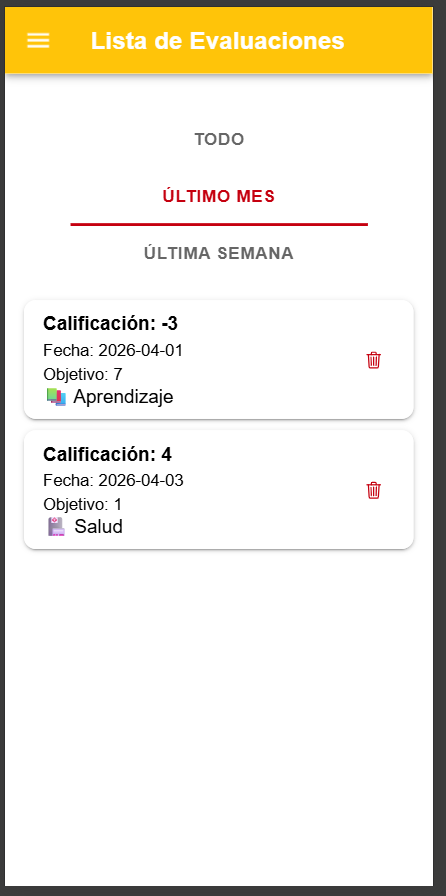
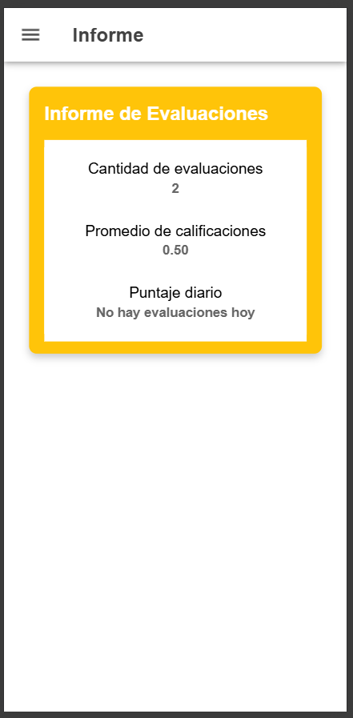
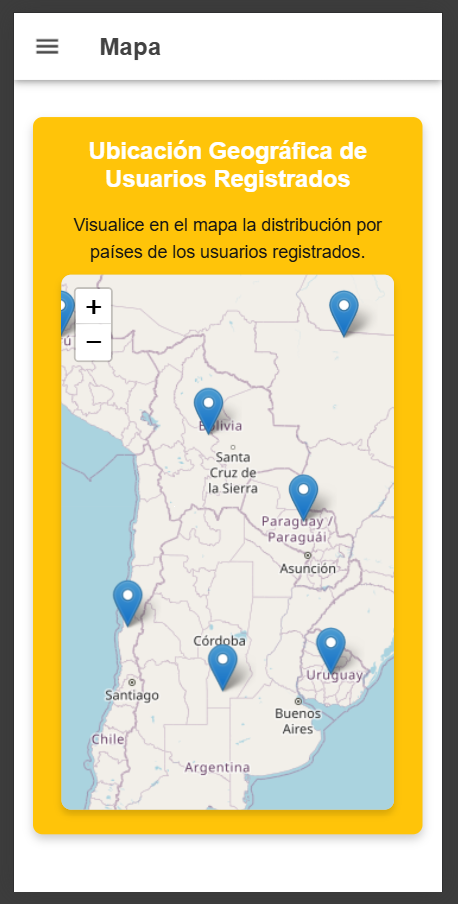

# Goalify

Una aplicación web **mobile-first** para el seguimiento de objetivos personales mediante autoevaluaciones diarias. Los usuarios pueden registrar objetivos, valorar su progreso diario en una escala de **-5 a 5** y consultar su rendimiento a lo largo del tiempo mediante una lista de evaluaciones filtrable, un informe resumen y un mapa interactivo que muestra la distribución geográfica de los usuarios registrados.

> Proyecto individual realizado para **Taller de Dispositivos Móviles** (2° semestre) - Analista en Tecnologías de la Información, ORT Uruguay.

[**→ Demo online**](https://nyah-r.github.io/Goalify/)

---

## Capturas de pantalla

<p align="center">
  
  
  
</p>

<p align="center">
  
  
</p>

---

## Funcionalidades

* **Registro e inicio de sesión**: cada usuario mantiene sus propios objetivos y evaluaciones mediante `localStorage`
* **Gestión de objetivos**: creación y categorización de objetivos personales
* **Autoevaluación diaria**: valoración de cada objetivo de -5 (muy mal) a 5 (excelente), con selector de fecha
* **Lista de evaluaciones**: filtrado por todo el período, último mes o última semana; permite eliminar evaluaciones individuales
* **Informe de rendimiento**: cantidad total de evaluaciones, puntuación promedio y puntuación del día actual
* **Mapa de usuarios**: mapa interactivo de Leaflet que muestra los usuarios registrados según su país

---

### Tecnologías utilizadas

| Tecnología       | Uso                                     |
| ---------------- | --------------------------------------- |
| **Ionic**        | Componentes y estructura de la interfaz |
| **Leaflet.js**   | Mapa interactivo                        |
| **localStorage** | Almacenamiento de datos en el navegador |
| **HTML**         | Estructura de la aplicación             |
| **CSS**          | Estilos y diseño visual                 |
| **JavaScript**   | Lógica y funcionalidades                |

---

## Arquitectura

Aplicación de una sola página estructurada mediante la navegación por pestañas de Ionic.

```text
├── index.html        # Estructura principal, pestañas de Ionic y marcado de las páginas
├── main.js           # Toda la lógica: autenticación, CRUD de objetivos, evaluaciones, mapa e informes
├── estilos.css       # Estilos personalizados sobre los estilos predeterminados de Ionic
└── img/              # Imágenes y capturas de pantalla de la aplicación
```
